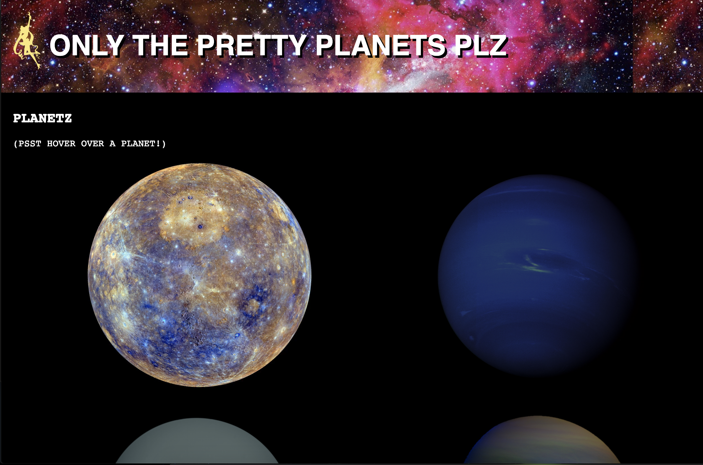

# Planet Photo Album ✨

First static React build showcasing some pretty planets from our lovely galaxy. (Yes, I included Pluto.) 



## Getting Started

Fork this repository, npm i to install all required node modules.
``` npm i ```
``` npm run build ``` (optional)
``` npm start ```

## Deployment

(Check it out on netlify!)[https://vigilant-stonebraker-f8104c.netlify.com/]

## Built With

* [React](https://reactjs.org/docs/getting-started.html)

## Authors

* **Paige Gorry** [Github](https://github.com/paigeegorry)

## License

This project is licensed under the MIT License - see the [LICENSE.md](LICENSE.md) file for details

## Acknowledgments

* NASA - thanks for being so cool
* Milky Way - thanks for being so pretty
* Sailor Moon - thanks for the logo
* Alchemy Code Lab
